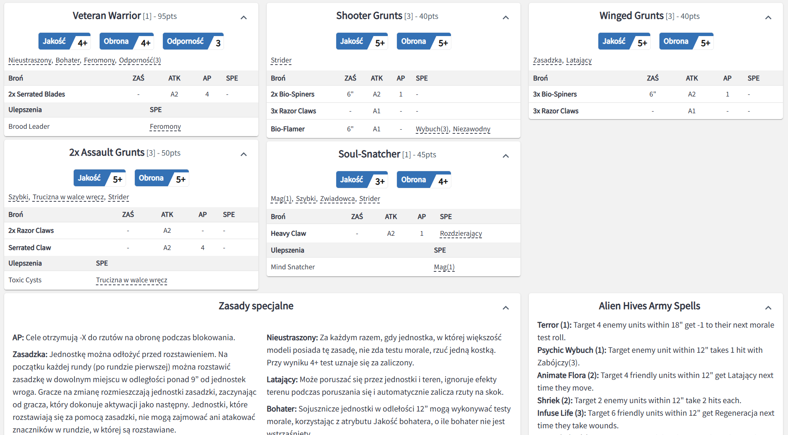

# opr-pl
Skrypt do Tampermonkey, który automatycznie podmienia opisy zdolności na stronie Army Forge OPR, używając zewnętrznego pliku.

**Update 3.5:**

Jestem w trakcie tłumaczenia aktualizacji 3.5. Niestety ze względu na dodanie tooltipów tłumaczenie jest trudniejsze. Na chwilę obecną działają pełne tłumaczenia na ostatniej stronie tworzenia listy przy wydruku (tam gdzie nie ma tooltipów).

**Instalacja:**

1. Pobierz i zainsaluj wtyczke <a href="https://www.tampermonkey.net/">Tampermonkey</a> do swojej przeglądarki internetowej (Chrome, Edge, Firefox, Safari, Opera Next).
2. Postępuj zgodnie z instrukcjami wtyczki aby włączyć tryb developerski i uprawnienia do modyfikowania stron dla wtyczki.
3. Wklej kod z pliku Tłumacz OPR.js do swojego nowego skryptu w Tampermonkey.
4. Zezwól skryptowi na połączenie się z zewnętrznym plikiem (tlumaczenia.json) aby pobrać tłumaczenia z Githuba.
5. Przejdz na stronę Army Forge i drukuj listy armii po polsku.

**Postęp tłumaczenia:**

| Frakcja  |  GF  |  GFF  |  AoF  |  AoFS  |
| ------------- | ------------- | ------------- | ------------- | ------------- |
| Alien Hives |   ✔️   |   ✔️   |      |   ✔️   |
| Battle Brothers |   ✔️   |   ✔️   |      |   ✔️   |
| Blessed Sisters |   ✔️   |  ✔️  |      |   ✔️   |
| Custodian Brothers |   ✔️   |   ✔️   |      |   ✔️   |
| DAO Union |   ✔️   |   ✔️   |      |   ✔️   |
| Dark Elf Raiders |   ✔️   |   ✔️   |      |   ✔️   |
| Dwarf Guilds |   ✔️   |   ✔️   |      |   ✔️   |
| Elven Jesters |   ✔️   |   ✔️   |      |   ✔️   |
| Eternal Dynasty |   ✔️   |   ✔️   |      |   ✔️   |
| Gangs of New Eden |      |  ✔️    |      |   ✔️   |
| Goblin Reclaimers |   ✔️   |   ✔️   |      |   ✔️   |
| Havoc Brothers |      |   ✔️   |      |   ✔️   |
| High Elf Fleets |   ✔️   |   ✔️   |      |   ✔️   |
| Human Defense Force |      |  ✔️   |      |   ✔️   |
| Human Inquisition |      |  ✔️   |      |   ✔️   |
| Infected Colonies |      |   ✔️   |      |   ✔️   |
| Jackals |      |   ✔️   |      |   ✔️   |
| Machine Cult |      |   ✔️   |      |   ✔️   |
| Orc Marauders |      |   ✔️   |      |   ✔️   |
| Prime Brothers |      |   ✔️   |      |   ✔️   |
| Ratmen Clans |      |   ✔️   |      |   ✔️   |
| Rebel Guerrillas |      |   ✔️   |      |   ✔️   |
| Robot Legions |      |   ✔️   |      |   ✔️   |
| Saurian Starhost |      |   ✔️   |      |   ✔️   |
| Soul-Snatcher Cults |      |   ✔️   |      |   ✔️   |
| Titan Lords |      |   ✔️   |      |   ✔️   |
| Wormhole Deamons  |      |   ✔️   |      |   ✔️   |

| Funkcja |  Postęp  |
| ------------- | ------------- |
| Aury |  ✔️  |
| Czary |     |
| Tooltipy |     |
| Nazwy broni |     |

Tłumaczenia wygenerowane przez Google Gemini z poprawkami, aby urzymać nazwenictwo One Page Rules. Zasady nie są w żaden sposób modyfikowane i są wiernym tłumaczeniem ich wersji angielskiej.

Twórcą i wlaścicielem zasad jest One Page Rules (https://www.onepagerules.com/).

